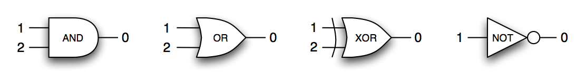

# Homework #2

**Due: Thurs, Jul 7, 3:59pm**

## How to Submit

You should produce a single file, named `HW2.<your-username>.hs`. This file *must compile without errors* in GHCi. Put all non-working parts of your solution in comments! If your file does not compile, **it will not be evaluated**.

You must submit:

1. A digital copy of your file through [TEACH](http://engr.oregonstate.edu/teach). This is due by the date and time specified above.

2. A paper printout of your file in class or during office hours on the due date. *Please double check that your name(s) and OSU ID number(s) are on this printout!*

Submit one solution *per team* (each team can have 1--3 members). Make sure to put the names and OSU ID numbers of each team member in a comment in the submitted file. Submit only **one** digitial file and **one** printout *per team*.

Please preserve the existing `doctest` comments in the template (the lines that begin with `>>>` and have results below them). This will help during grading.

**Late submissions will not be accepted**. Please do not send solutions by email.

**Partial credit**: if you can't solve a problem, you can get partial credit by describing in comments what you attempted to do, where you got stuck, and what you believe your next step might be.

## Description

Template: **[HW2.hs](../code/HW2.hs)**

For all exercises, you are free to define whatever helper functions you need. You may also use functions from the Prelude and Data.List. You may find the functions `intersperse` or `intercalate` in Data.List useful for inserting commas in your implementation of `pretty`.

### Exercise 1: MiniLogo

**MiniLogo** is a toy version of the [Logo Language](http://el.media.mit.edu/logo-foundation/logo/programming.html) for programming simple 2D graphics. A MiniLogo program describes a graphic by a sequence of `move` commands that move a pen from one position to another on a [Cartesian plane](https://en.wikipedia.org/wiki/Cartesian_coordinate_system), drawing lines as it goes. For example, here is a MiniLogo program that draws a 2x2 square with its bottom-left corner at the origin.

~~~
pen up; move (0,0);
pen down; move (2,0); move (2,2);
          move (0,2); move (0,0);
~~~

Conceptually, the MiniLogo execution environment consists of two parts:

  * a *canvas* rooted at position `(0,0)` and extending infinitely upward and to the left
  * a *pen* which is always located at a certain position on the canvas, and which can be in one of two modes (states), either `up` or `down`

The `move` command moves changes the location of the pen from one position to another. If the pen is `down` when it begins its move, it draws a straight line between the starting position and ending position. If the pen us `up` when it begins its move, it just changes location to the new position without drawing a line. The mode of the pen can be changed by invoking the `pen` command as illustrated in the above example.

In addition to basic `pen` and `move` commands, a MiniLogo program can define and invoke *macros*. A macro is a procedure that takes some coordinate values as inputs and performs some commands. Within the body of a macro, commands can refer to input values *by name*.

The syntax of the MiniLogo language is defined by the following grammar:

------- -----  -------------------------------------------------
  *cmd*  ::=   `pen` *mode*
          |    `move` `(` *pos* `,` *pos* `)`
          |    `def` *name* `(` *pars\** `)` *cmd*
          |    `call` *name* `(` *vals\** `)`
          |    *cmd*; *cmd*
 
 *mode*  ::=   `down`   |   `up`
 
  *pos*  ::=   *num*   |   *name*
 
 *pars*  ::=   *name*; *pars*   |   ε
 
 *vals*  ::=   *num*; *vals*   |   ε
------- -----  -------------------------------------------------

### Tasks

1. Define the abstract syntax of MiniLogo as a set of Haskell data types. You should use built-in types for *num*,  *vals*, and *name* -- such as `Int` and `String`. If you want to define a type `Num` you will have to hide that name from Prelude.

2. Define a MiniLogo macro `vector` that draws a line from a given position (`x1`, `y1`) to a given position (`x2`, `y2`) and represent the macro as a Haskell data type value, that is *abstract syntax*.

>>What you are actually doing is writing a MiniLogo program that defines a `vector` macro. So the answer should have the following form.

>>~~~
>>def vector (...) ...
>>~~~

>>This is the *concrete syntax*. Then you should write the same MiniLogo program in *abstract syntax* in the following form (assuming `Def` is the constructor name representing the `def` production of the Haskell data type).

>>~~~
>>vector = Def "vector" ... ...
>>~~~

3. Define a Haskell function `steps :: Int -> Cmd` that constructs a MiniLogo program which draws a stair of *n* steps.

### Exercise 2: Digital Circuit Design Language

Digital circuits can be built using the following four basic types of logical gates.

The syntax of the Digital Circuit Design Language is defined by the following grammar:

--------- -----  ---------------------------------------------------------
*circuit*  ::=   *gates*; *links*
 
  *gates*  ::=   *num*; *gateFn*; *gates*   |   ε
 
 *gateFn*  ::=   `and`   |   `or`   |   `xor`   |   `not`
 
  *links*  ::=   `from` *num* . *num* `to` *num* . *num*; *links*    |   ε
--------- -----  ---------------------------------------------------------

Notice that the logical gates as well as their input/output ports are identified by numbers. The inputs of a gate are numbered *from top to bottom*, starting from `1`. The output is always numbered `0`. Consider the following circuit -- a half adder.

This circuit can be defined by the following Digital Circuit Design Language program.

~~~
1:xor;
2:and;
from 1.1 to 2.1;
from 1.2 to 2.2;
~~~

### Tasks

1. Define the abstract syntax of the Digital Circuit Design Language as a set of Haskell data types. You should use built-in types where possible.

2. Represent the half adder circuit as a Haskell data type value using the data types defined in Task 1. This corresponds to the *abstract syntax* of the Digital Circuit Design Language.

3. Design a Haskell function `ppCircuit :: Circuit -> String` that pretty-prints a Digital Circuit Design Language circuit. That is, it transforms the *abstract syntax* (a Haskell data type value) into nicely formatted *concrete syntax* (a string of characters). Your pretty-printed circuit should look simlar to the half adder example given above.

>In GHCi, you can render a string with newlines by applying function `putStrLn`. So, to pretty-print a circuit `c` use: `putStrLn (ppCircuit c)`.

### Exercise 3: Designing Abstract Syntax

Consider the following abstract syntax for arithmetic expressions.

~~~
data Expr = N Int
          | Plus Expr Expr
          | Times Expr Expr
          | Neg Expr
~~~

Now consider the following alternative abstract syntax (recall that the "`'`" has no significance other than allowing us to diferentiate between multiple definitions of the same name in a single Haskell file).

~~~
data Op = Plus' | Times' | Neg'

data Expr' = N' Int
           | Apply Op [Expr']
~~~

### Tasks

1. Represent the expression `-(3+4)*7` in the alternative *abstract syntax*.

2. What are the advantages and disadvantages of either representation?

3. Define a function `translate :: Expr -> Expr'` that translates expressions given in the first *abstract syntax* into equivalent expressions in the alternative *abstract syntax*.

 

[Back to course home page](../index.html)
